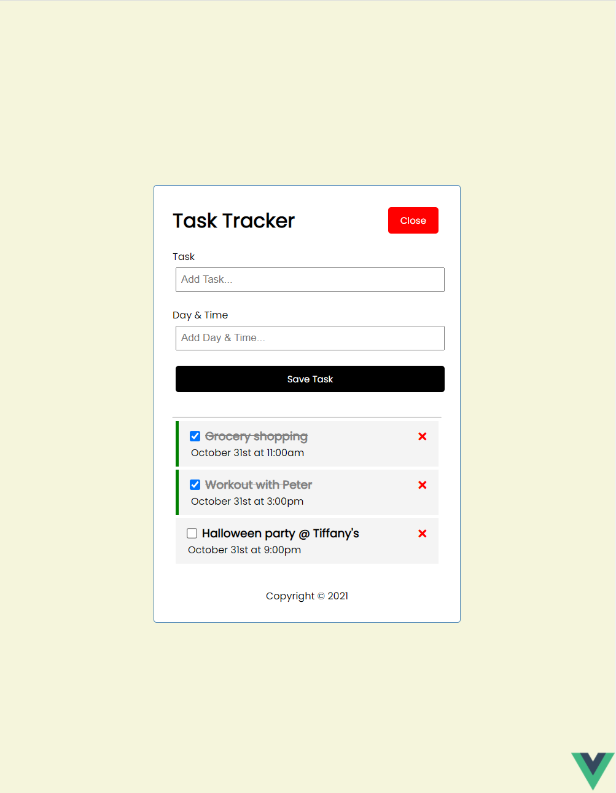

# vue-task-tracker

Deployed Link (https://dazzling-franklin-a38272.netlify.app/)

## Description

Simple task tracker built with VUE.js and localStorage. Deployed with netlify.

## Project Demo

- Locations with low temperatures will show blue background.
  

## Project setup

```
npm install
```

### Compiles and hot-reloads for development

```
npm run serve
```

### Compiles and minifies for production

```
npm run build
```

### Customize configuration

See [Configuration Reference](https://cli.vuejs.org/config/).
